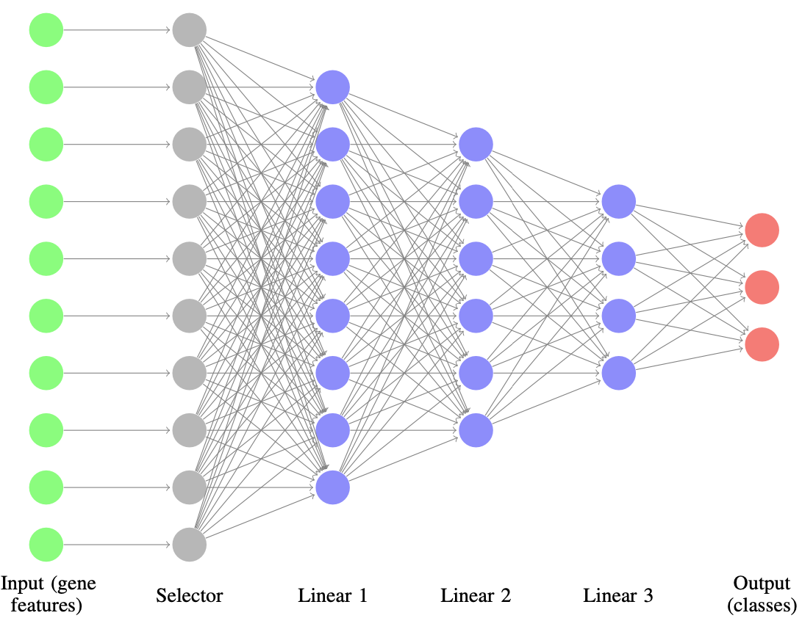

# SelectorMLP

A PyTorch-based feature selection and classification framework for high-dimensional biological data such as single-cell gene expression.

## About

SelectorMLP combines the power of neural networks with feature selection capabilities to identify important features (e.g., genes) in high-dimensional datasets while performing classification tasks. The basic question is, "in a single-cell RNA sequencing dataset, which genes are most important for separating cells by type?" To answer this question, I created a specialized MLP architecture with a feature selection layer. The feature selection layer learns to assign weights to each feature during training, which can be encouraged to be sparse using L1 regularization. Then gene features with highest magnitude weights are assumed to be most important. By sorting the genes by weights, any arbitrary number of features can be selected.



- Comparison with baseline SVM models
- Tools for evaluating feature importance
- Support for AnnData objects commonly used in single-cell analysis
- PyTorch Lightning integration for efficient training

The

This is an updated and refined version of my 2022 final project of my Deep Learning class (CS 5787) at Cornell Tech. 

Originally it was a Colab notebook; I have refactored it for easier installation and use. The original report, which contains much of the original code, is included at docs/report.pdf. The report also includes more information on the model architecture. This version contains all necessary code to train the models shown in the report; for some figures, config files must be altered or additional visualizations produced.

After I completed my project, I encountered a similar solution by Covert *et al.* from Stanford. In addition to the 
- Their paper: https://www.nature.com/articles/s41467-023-37392-1
- Their GitHub

## Installation

First, clone the repository:
```bash
git clone https://github.com/yourusername/gene-selector-mlp.git
cd gene-selector-mlp
```

Then, install necessary packages. You can use pip with development mode:
```
pip install -e .'
```
Or install dependencies directly:
```
pip install -r requirements.txt
```

It's strongly suggested to install all packages in a virtual environment using either venv or conda.

## Usage

An example workflow using the existing dataset (raw_data/adata.h5ad.gz) is available at example_workflow.sh. The code is reproduced below.
It consists of several steps:
- Split the AnnData object into train, validation and test sets using split_data.py (config: config/split_data.json). The splitting process balances classes by putting caps on the number of cells from each class/cluster that can be assigned to each of the train, validation, and test sets. There is also an option min_cluster_size to filter classes that have too few cells.
- Train SelectorMLP and SVM models on the train and validation sets (config: configs/train.json). Configuration options include training parameters, model parameters, logging, checkpointing, etc. For the SelectorMLP, training loss curves are saved to the corresponding log folder. Best models are also saved to trained_models_dir.
- Perform feature selection using the trained models.


### Data Preprocessing

Split your AnnData object into train/validation/test sets:


### Model Training

Train a SelectorMLP model:

```bash
python src/train.py --config configs/train.json --model_type selector_mlp
```

Train a baseline SVM model:

```bash
python src/train.py --config configs/train.json --model_type svm
```

Example configuration (`configs/train.json`):
```json
{
    "restart": false,
    "log_dir": "logs",
    "data": {
        "input_dir": "intermediate_files/split_data",
        "y_column": "Main_cluster_name"
    },
    "dataloader": {
        "batch_size": 256,
        "num_workers": 4,
        "shuffle_train": true,
        "shuffle_val": false
    },
    "model": {
        "name": "SelectorMLP",
        "selector_type": "std",
        "reg_type": "L1"
    },
    "training": {
        "lr": 0.0003,
        "weight_decay": 0.3,
        "dropout": 0.3,
        "batch_norm": false,
        "noise_std": 0.2,
        "max_epochs": 50
    }
}
```

### Feature Selection

Evaluate feature importance:

```bash
python src/feature_selection.py --config configs/feature_selection.json --model_path logs/SelectorMLP
```

Example configuration (`configs/feature_selection.json`):
```json
{
  "model_path": "logs/SelectorMLP",
  "adata_input": "intermediate_files/split_data/adata_val.h5ad",
  "y_column": "Main_cluster_name",
  "group_size": 50,
  "random_reps": 5,
  "results_dir": "feature_selection_results"
}
```

### Complete Workflow

Run the entire pipeline:

```bash
./example_workflow.sh
```

## Model Details

### SelectorMLP Architecture

The SelectorMLP model consists of:

1. **Selector Layer**: A specialized layer that applies weights to input features
2. **MLP Backbone**: Three fully-connected layers with batch normalization and dropout
3. **Regularization**: L1 or L2 regularization on selector weights to encourage sparsity

Selector types:
- `std`: Standard feature selector with unclamped weights
- `clamped`: Feature selector with weights clamped between 0 and 1
- `none`: No feature selection (standard MLP)

### Feature Selection Process

1. Train a SelectorMLP model on your data
2. Extract feature importance weights from the selector layer
3. Rank features by their absolute weight values
4. Evaluate model performance using different numbers of top-ranked features
5. Compare with randomly selected features as a baseline

## HPC Submission

For large datasets, you can submit jobs to an HPC cluster:

```bash
sbatch --partition=hpc_a10_a \
       --time=1:00:00 \
       --nodes=1 \
       --ntasks=1 \
       --cpus-per-task=4 \
       --mem=128G \
       --gpus=a10:1 \
       --job-name=SelectorMLP_train \
       --output=logs/SelectorMLP/train.out \
       --error=logs/SelectorMLP/train.err \
       --wrap="source ~/.bashrc && conda activate torch && python src/train.py --config configs/train.json"
```

## License

[MIT License](LICENSE)

## Citation

If you use this code in your research, please cite:

```
@software{SelectorMLP,
  author = {Your Name},
  title = {SelectorMLP: Feature Selection with Neural Networks},
  year = {2023},
  url = {https://github.com/yourusername/gene-selector-mlp}
}
```
